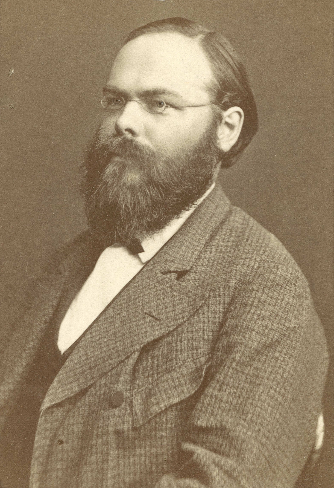

# Domain-Decomposition
Jupyter Notebooks and Matlab scripts illustrate solving a system using Additive Schwarz and  Multiplicative Schwarz.

Matlab is by Simon Tavener.

Python is by Andre Leautaud.

